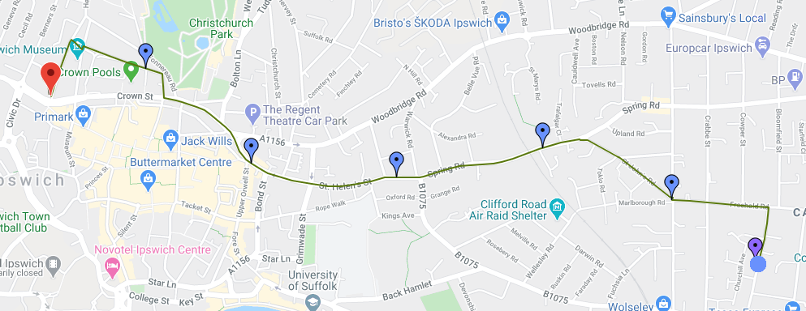
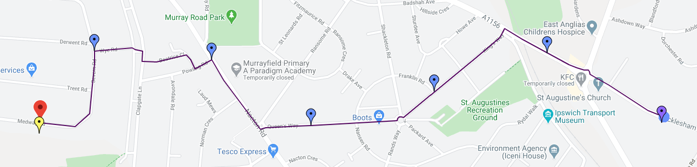
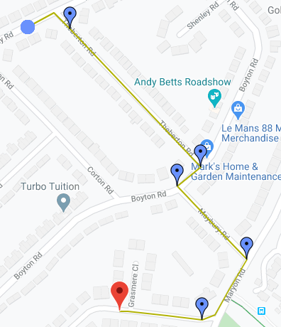
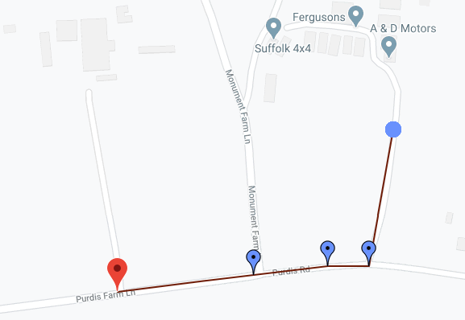
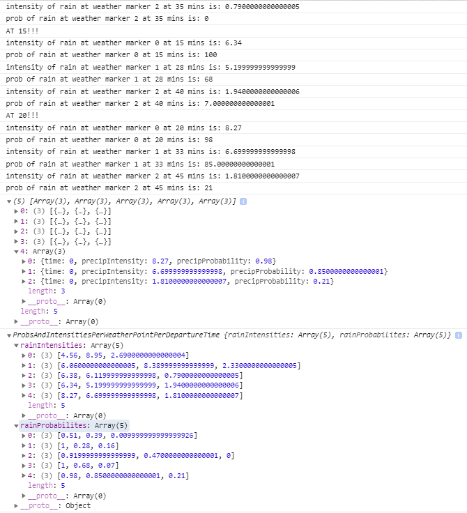
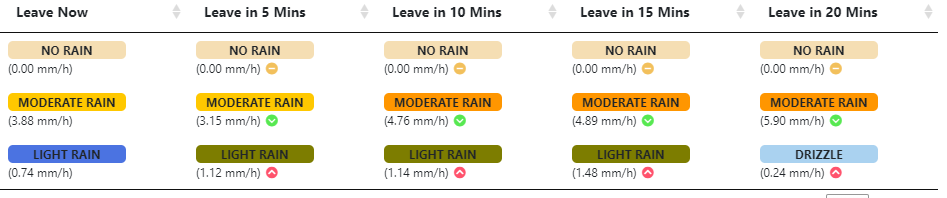

# WeatherRoutingFrontEnd Technical Achievements
this is a angular framework appliction that is user facing. Below is information that is more technical so is here in the technical documentation rahter than the report.

## Languages
There are many languages I had to use for this coursework. This increases the complexity of the application by the introduction alone. The knowledge then needs to exponentially grow outwards to not only cover the foundations of the languages, however, to do the advanced processes and code in a clean way. This is a large technical achievement in its own right.

### Html
Html is used in the frontend to define the structure of a webpage. I use Angular directives such as NgIf, NgClass, ng-template, ng-click, {{}} etc. I use regularly two-way binding using ngModel. Angular allows for easy advanced manipulation of html documents.

### Sass
I decided to use Sass. This is a reputable and well-known language extension on CSS. CSS, and therefore Sass, is the language that controls the design of the web pages. I decided to use sass over CSS mainly for the ability to write cleaner code. This is achieved by using selector indentation and variables.

### TypeScript
TypeScript is a language which builds on top of JavaScript, its main benefit is that it adds static type definitions. For me personally, strong typing allowing for quick error catching process and the ability to save objects really helps me code in OOP and avoid development problems down the road.
Typescript adds the component logic in the Angular framework. I have worked with Angular before this so that helped with the implementation of code.

### JavaScript and jQuery
jQuery is a JavaScript language that helps simplify the use of JavaScript. I have had to use jQuery and subsequently JavaScript in the “table” component on the datatables.net table. This was used to grab the table element from the DOM and to perform interactions on the rows such as highlighting the route or retrieving the route id on click. This added another layer of complexity.

### C#
This is the programming language that comprises the backend. I have used C# and the .Net Core before, so this helped with creating the controllers, using attributes etc.

### SQL and T-SQL
SQL is the language I used to generate the tables and relationships to make up my database. T-SQL is a programming extension which adds functionality additions such as the use of variables. I use T-SQL to create stored procedures which is the industry standard to communicate between the database and the backend. 

## Notable Advanced Logic
There are many techincal achievements of this project. The size and structure alone is complex in itself. Labelled below are technical achievements that i wanted to display here in the technical documentation due to the logical complexity.

### Componentisation
Angular brings an excellent platform to perform componentisation. This is the act of splitting and isolation code based on their area of concern. This helps with enforcing Single Responsibility principle and keeping code from becoming an anti-pattern of spaghetti code. I am confident in saying that the way I have split my program has been done correctly and if someone was to be working alongside me, we could work on each part independently (apart from services calls).

The use of models as well is a great way to clearly define OOP principles for the storing, generation, and usage of data. This again helps to consolidate data management to promote loose coupling.

### Services and Dependency Injection
Alongside Components are services. Services are in control of the data access; components should focus on presenting data. I have implanted this format by many services mainly routing Service and weather Service.

I have then performed dependency injection by passing these services through the constructor. This allows for loose coupling.

### Component Communication
I have implemented Component Communication. This is done through output component properties to emit events to the parent. Parent to child communication happens through the ViewChild Property to access child methods and properties.

### Observers, promises, subscriptions
I use observables for passing information between components in the application. These can then be subscribed to. What this allows me to use the observer pattern. The beauty of this implementation is that multiple components can receive the same data. Also the fact that you can subscribe and forget about it, then perform actions based on subscription triggering.

I use promises when I need just a simple return from an external call, this is because these are easier to await.

### Map and filtering of responses
I have used advanced logic of mapping and filtering to alter data in a uniform way to map correctly to objects to be used in the frontend.

### await, async
I used async code when communicating with the backend to make sure that the application does not freeze. I use await to make sure that calls to external processes finish before code following is executed stopping errors from occurring.

### Ability to use Fake weather information 
I created the feature of using fake weather data. This bypasses the call to Dark Sky (the API service I call to get weather information). I have done this for two reasons.

The first being that my application produces graphs on rain information. If there is no rain information anywhere in the country (which has happened) I would not be able to show this part of the system. By adding this feature, I can show how rain data is displayed even when there is no rain for the demo.

The second reason is that I have a capped 1000 calls to the API before I have to start paying. By using fake data, I can continue to use or work on development of my application without paying. This is not a problem with the other two APIs I use (google maps and TomTom) as I do not call those enough to go over the free number of calls given each month.

## Services
Services are injected into components to abstract away data manipulation; it also isolates the code so it is easier to manage. Service injection makes the program more loosly coupled and allows for easier testing.

There are four services that i have created, each which are designed to consolidate areas of information:
1. Authentification Service
2. Alert Service
3. Routing Service
4. Weather Service

## Authentification Service
This service encapsulates all communication with external sources regarding authentication and the status of the user login. This service can also be accessed to retrieve information on the currently logged in user to be used in other components.

### Cookie
This service assigns the username and token to the browser cookie. This is local storage that persists on page refresh. This is used to keep a user logged in after page refresh or navigation.

### Get Authorised Headers
This grabs the JWT token from the cookies. This then uses this value to create a HttpHeaders object which is used in the routing service to call the backend that requires authorisation (e.g. to get all user favourited routes).

### Login and Register
This handles the communication with the backend to login or register a user if the input values are valid. As the URL is only different between these two methods, I created unrepeating code by reusing the same code and having the difference in the URL be passes as a parameter in the method. A successful request means that this service also creates a cookie that 

### Logout
This removes the cookie information from the local storage. It also broadcasts that the next user is null so the rest of the program can respond correctly to a user being logged out.

## Alert Service
The alert service contains an alertSubject which can be subscribed to. It then has 3 methods for each of the success, warning, or error. These methods apply next to the subject which in turn emit from the observable. What this means is that any component who has this service injected, can not only set alerts to be constructed, but can also listen to alerts being transmitted, the only component  who actually needs this is the alert component who visually creates the alerts based on anything going through the subscription pipeline.

I am really happy with this solution as it is quite simple and provides a lot of flexibility. The sub scriber observer pattern is a really useful one to get right.

## Routing Service
The Routing service manages all the data and communication with the backend relating to routing.

### Route States
This service holds the Id of the route and also all of the routes being displayed. This value is then called by getter methods to get all routes, a route with a certain identifier, etc.

### Get Favourited Routes
This calls the backend using an authenticated request to get the routes back.

### Database Communication
This defines whether routes should be added to the database (favourited) or removed (deleted or unfavourited)

### User Cookie Expiry
There is code in place to make sure that if a user’s cookie has expired. That the user is logged out and the user is warned of this. This is known by receiving the unarthorised error code whilst the user is logged in (this means they hold credentials that are now out of date).

### Creation of Routes
This is the biggest process performed by this service. This service will first create the route and relating information such as elevation and location names.

It will then go on to associate weather information to this route. Before communication with the weather service the route must first place weather markers. This is done by placing weather markers equidistant apart, it is not as simple as assigning to the leg of a route as the distances between legs are vastly different. Weather markers are assigned to legs that are most equally distanced apart. For this we need to know the distance of a route. To generate distance between two latitude and longitude values I needed to use the Haversine Formula. 

### Haversine Formula
This is a formula that when entered two coordinates each with a latitude and longitude value, it will tell you the distance apart. The haversine Formula works on a sphere, we use the radius of the Earth however we all know that Earth is not a sphere but rather a lumpy oblate spheroid. This means that formula will not produce a 100% accurate result. It depends on where you are on Earth and the elevation of the Earth. I have however performed experiments and what I have found is that the minor changes in elevation and the vaired shape of Earth does not alter the result. This is because these small variations are such a relatively small component, so they make no change to the output. A route distance is defined in meters. The result I get back is always very similar to the true value. This means that this formula is sufficient to use in my program as this level of accuracy is required.

I have also  added functionality that if there are less legs than weather points it uses the number of legs. The following image was when 7 weather points where defined.

### Backend Routing Object to Frontend Object.
This service includes object manipulation to get the data in a format from the backend to a state that can be used by the frontend. This obejct is then worked on to work out greater routing details. 

### Get Lat/Lng Values From Location Name (vice-versa)
This communicates with the backend to get the location name or lat/lng depending on what is entered. If the name is returned it is then formatted to include only the most important information to reduce clutter.

## Weather Service
This service is what adds weather information to a route and communicates with the backend with weather relating queries.

### Adding Weather to Route
First, we get the minutely data from the backend. This data is assigned to each weather point we previously stated in the routing service.

The second part is that for each departure, we get the rain intensities and probabilities at this time, for each weather point. We then use these values to get the rain intensities and values at the weather point when the user will be at this point. We do this by working out the distance needed to travel and then divide this of the speed of the user. As we get minutely data for each minute up to an hour, we can find the minute where the user will be predicted to be at this point, and then use this value. 

For example, if the person leaves at a departure time of 15 minutes and I have worked out that it will take 4 minutes to get to the first weather point. I look at the rain values for 19 minutes in. 

Finally, the current weather is added to the object finalising the weather information for the route. This is retrieved by a call to the backend.

### Rain Descriptor
This is also where I calculate the rained scripter, based on the rain intensity passed in you will be given a descriptor and colour depicting how intense the rain is.

## Testing
I decided to do manual testing for this project. This is due to the smaller timescale.

There were two forms of testing i performed, unit and integratin testing. I performed edge cases on both these testing methods. This was the act of not only using correct data, but also using boundary and errornous infromation. This was used to make sure that when incorrect details were passed, that the application knew what to do next, not crashing and informing the user accordingly.

### Unit Testing
Unit testing is the act of testing code that performs one responsibility. This is tol ensire that no bugs or defects arise by making sure that methods perform their task perfectly and with the correct logic.   

I performed manual unit testing focusing on one responsbility, this would be a method due to the way i have coded to ensure the Single Responsibility Principle. This would mean that if a bug arose i could quickly find the problem due to isolated areas of concern.

### Integration Testing 
I also performed integation testing. These were done by going through use cases, i would use the system as how a user would. This would help define defects of code not working as intended.

Integration testing is all about testing different reponsbility and layers of code to perform a full action. This means that i would perform each test and see how the layers of communication would interact with eachother. 

### Automated Testing
I did not do this due to the time constraint and also most of the code present on the database and backend layer are not unit testable without the use of mocking.

To show however that i can write unit tests i did an example on a method present in the backend. I used Xunit to Achieve this. I use the logical framework of Arrange, Act and Assert (AAA) to maintain test logic throughout the code. I use the naming scheme for the test names:  methodName_whatIsPerfomed_WhatIsTheExpectedOutcome

To run these tests it is inredbily simple
1. Open Visual Studio
2. Click on the "Test" tab
3. Press "Run All Tests"

The program will build and the test explorer will appear, showing all the tests and if they have passed or failed. If a test fails an message and line number will help debug why the test failed.
